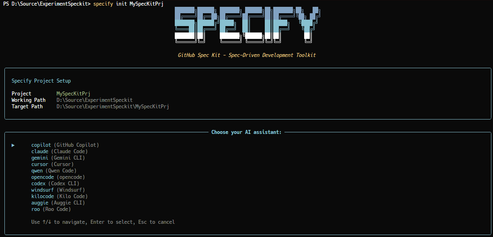
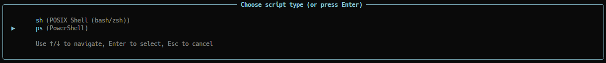
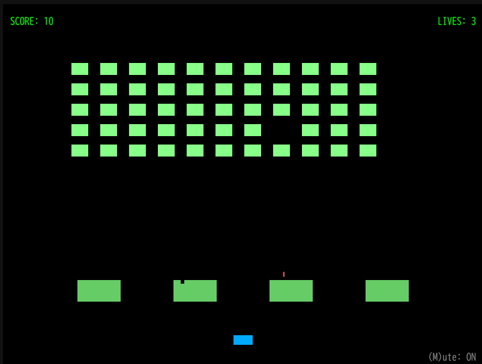
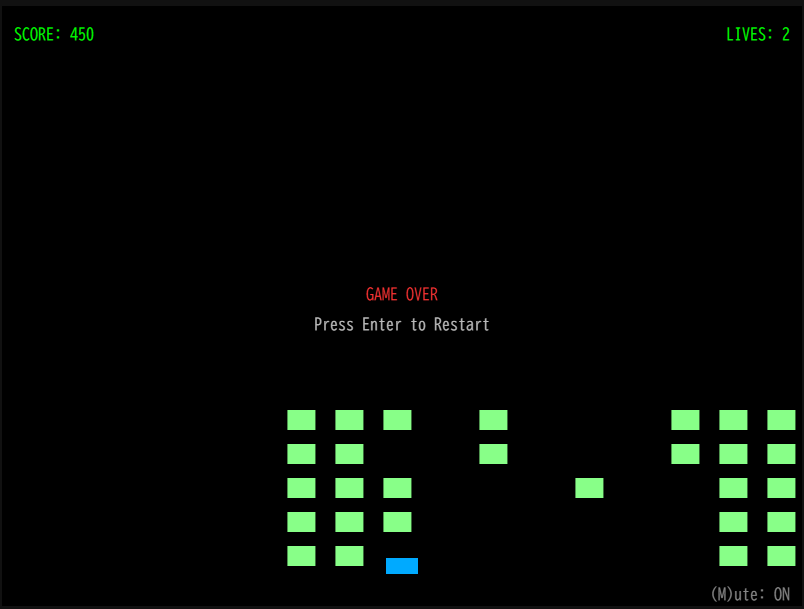

# SpecKit環境構築から実装までのメモ

SpecKitを使ったAIによる仕様駆動型開発のお試しを行った際のメモです。
今回は時間がなかったのでプロンプトもWebからの流用でAI Assistantとチャット上で揉むというのが出来なかったです。チャットで仕様についてプロンプトで指示するとドキュメント作成（markdown）から実装までAI Assistantがやってくれました。
AWS KIROを触ったことがないので比較ではないですが、KIROだともっとチャットで相談しながら実装できたりするのだろうか。

## Cursorインストール
[公式](https://cursor.com/ja)より、OSに合わせたインストーラをダウンロードしてセットアップする。
設定はすべてデフォルト。

## UV環境のインストール

### UVとは
Astral社がRustで開発した、非常に高速なPythonパッケージ管理ツールです。従来のpip、venv、pip-tools、pyenvなど複数のツールで行っていた作業を、uv一つで統合的に実行できるのが特徴で、依存関係のインストールや解決、仮想環境の管理、そしてPython自体のバージョン管理も可能。

Speckitの環境構築を行うために必要なのでインストールする。

Windows環境の場合は以下のコマンドでインストール可能。詳しくは[公式](https://docs.astral.sh/uv/getting-started/installation/#pypi)のインストール説明を参照。

```powershell
powershell -ExecutionPolicy ByPass -c "irm https://astral.sh/uv/install.ps1 | iex"
```

## SpecKit環境の構築

以下のコマンドを実行しAI Assistantを選択する。

* SpccKit Install して初期化(Install しない場合は後述のコマンド)
    ```powershell
    uv tool install specify-cli --from git+https://github.com/github/spec-kit.git
    specify init <PROJECT_NAME>
    specify check
    ```

* Specify Install せずに初期化
    ```powershell
    uvx --from git+https://github.com/github/spec-kit.git specify init <PROJECT_NAME>
    ```

* 初期化画面でAI assistant と Script type を選択する（筆者環境ではcursorとPowerShellを選択）
  
  

* 初期化されたファイル構造を確認
  初期化されると次のようなフォルダが作成されます
    ```
    D:\SOURCE\EXPERIMENTSPECKIT
    |   
    +---mdImages
    |       init_1.png
    |       init_2.png
    |       
    \---MySpecKitPrj
        +---.cursor
        |   \---commands
        |           analyze.md
        |           clarify.md
        |           constitution.md
        |           implement.md
        |           plan.md
        |           specify.md
        |           tasks.md
        |           
        \---.specify
            +---memory
            |       constitution.md
            |       
            +---scripts
            |   \---powershell
            |           check-prerequisites.ps1
            |           common.ps1
            |           create-new-feature.ps1
            |           setup-plan.ps1
            |           update-agent-context.ps1
            |           
            \---templates
                    agent-file-template.md
                    plan-template.md
                    spec-template.md
                    tasks-template.md
                    
    ```

* アウトプットを日本語にする
  初期の設定では成果物はすべて英語で出力されてしまうので、日本語で出力されるようにプロンプトを変更する。
  [こちらのサイト](https://zenn.dev/seo/articles/b66b99f2560b0f)を参考に```.cursor\commands```のファイルを編集する。

## 仕様を書く（/specify）

Carsor の AI Assistant チャット画面へ仕様を記載していきます。
先頭には```/specify```をつけて仕様の内容であるというコマンドを送ります。
今回は仕様のプロンプトを考える時間がなかったため、[こちら](https://zenn.dev/n_san/articles/e1fcdd79d1af32)の仕様プロンプト例を使わせていただいた。

## 計画を立てる（/plan）

Carsor の AI Assistant チャット画面へ計画を記載していきます。
先頭には```/plan```をつけて軽なくの内容であるというコマンドを送ります。

## タスクに分解する（/tasks）

Carsor の AI Assistant チャット画面へタスクを記載していきます。
先頭には```/tasks```をつけて軽なくの内容であるというコマンドを送ります。

## 実装する

Carsor の AI Assistant チャット画面でタスクにしたがって実装を行うように指示を出します。

## 実装されたゲーム

実装されたゲームのキャプチャです。




## 作成された仕様書およびソースコード、プロンプトの履歴

下記フォルダ構成を参照。プロンプトの履歴は[こちら](./cursor_.md)。

```
D:\SOURCE\EXPERIMENTSPECKIT
|   cursor_.md          プロンプトとAI Assistantとのチャット
|   Readme.md           本ファイル
|   
+---mdImages
\---MySpecKitPrj
    |   index.html      ゲーム起動用のindexファイル
    |   plan.md         実装計画ファイル
    |   spec.md         仕様ファイル
    |   tasks.md        タスクファイル
    |   
    +---.cursor
    +---.specify
    \---src             実装ソースコード
```